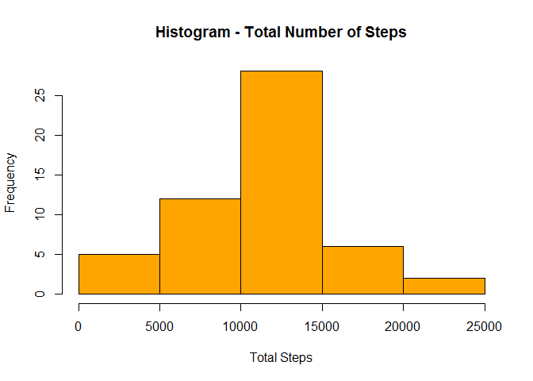
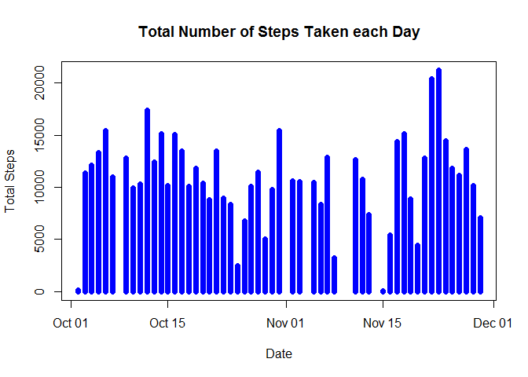
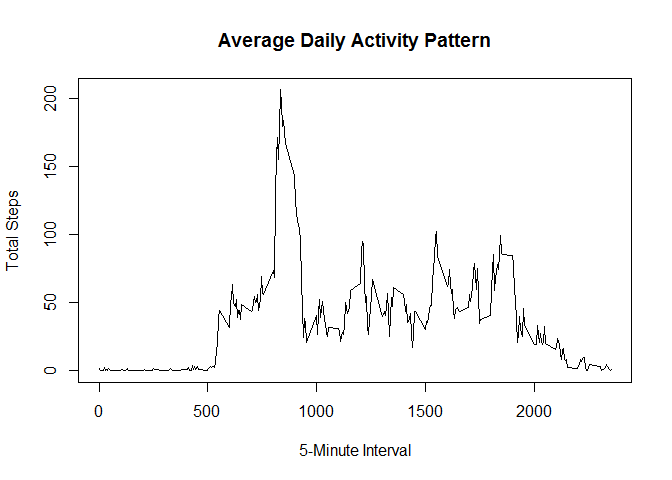
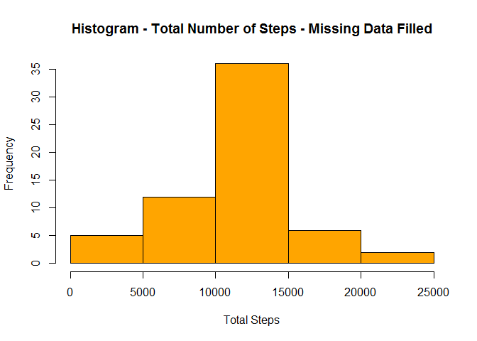
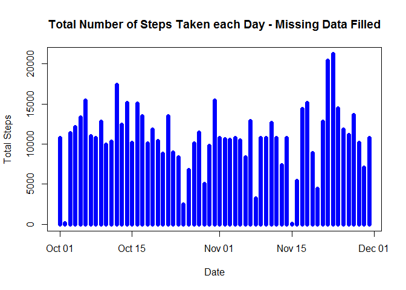
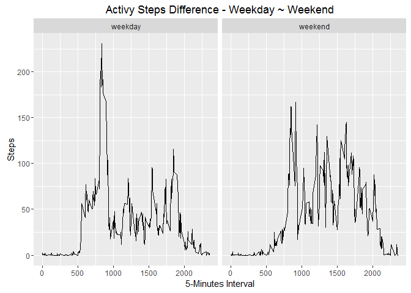

# Reproducible Research: Peer Assessment 1

## Making sure that code is visible.

```r
echo = TRUE
```

## Loading and processing the data.

```r
fileURL <- "https://d396qusza40orc.cloudfront.net/repdata%2Fdata%2Factivity.zip"
fileZIP <- "dataSetUCI.zip"
download.file(fileURL, destfile = paste(".\\", fileZIP, sep = ""), method = "curl")
fileName <- unzip(fileZIP, list = FALSE, overwrite = TRUE, exdir = getwd())
dataFile <- read.csv(fileName, sep = ",", header = TRUE)
head(dataFile)
```

```
##   steps       date interval
## 1    NA 2012-10-01        0
## 2    NA 2012-10-01        5
## 3    NA 2012-10-01       10
## 4    NA 2012-10-01       15
## 5    NA 2012-10-01       20
## 6    NA 2012-10-01       25
```

```r
summary(dataFile)
```

```
##      steps                date          interval     
##  Min.   :  0.00   2012-10-01:  288   Min.   :   0.0  
##  1st Qu.:  0.00   2012-10-02:  288   1st Qu.: 588.8  
##  Median :  0.00   2012-10-03:  288   Median :1177.5  
##  Mean   : 37.38   2012-10-04:  288   Mean   :1177.5  
##  3rd Qu.: 12.00   2012-10-05:  288   3rd Qu.:1766.2  
##  Max.   :806.00   2012-10-06:  288   Max.   :2355.0  
##  NA's   :2304     (Other)   :15840
```

```r
mean(is.na(dataFile))
```

```
## [1] 0.04371585
```

```r
sum(is.na(dataFile))
```

```
## [1] 2304
```

```r
str(dataFile)
```

```
## 'data.frame':	17568 obs. of  3 variables:
##  $ steps   : int  NA NA NA NA NA NA NA NA NA NA ...
##  $ date    : Factor w/ 61 levels "2012-10-01","2012-10-02",..: 1 1 1 1 1 1 1 1 1 1 ...
##  $ interval: int  0 5 10 15 20 25 30 35 40 45 ...
```

```r
dataFile$date <- as.Date(as.character(dataFile$date))
dataFileAvoidNA <- subset(dataFile, dataFile$steps != "NA")
sum(is.na(dataFileAvoidNA))
```

```
## [1] 0
```

```r
head(dataFileAvoidNA)
```

```
##     steps       date interval
## 289     0 2012-10-02        0
## 290     0 2012-10-02        5
## 291     0 2012-10-02       10
## 292     0 2012-10-02       15
## 293     0 2012-10-02       20
## 294     0 2012-10-02       25
```


## What is mean total number of steps taken per day?
For this part of the assignment, you can ignore the missing values in the dataset.

* Make a histogram of the total number of steps taken each day

```r
dataSteps <- unique(dataFileAvoidNA$date)
totalSteps <- tapply(dataFileAvoidNA$steps,dataFileAvoidNA$date, FUN = sum)
stepsDate <- c()
for (i in 1:length(totalSteps)) {
    
    stepsDate[i] = totalSteps[[i]]
  
}
hist(stepsDate, xlab = "Total Steps", ylab = "Frequency", main = "Histogram - Total Number of Steps", col = "orange")
```



```r
plot(dataSteps, stepsDate, pch = 19, xlab = "Date", ylab = "Total Steps", main = "Total Number of Steps Taken each Day", type = "h", lwd=7, col = "blue")
```



* Calculate and report the mean and median total number of steps taken per day

Mean total number of steps taken per day:

```r
mean(stepsDate)
```

```
## [1] 10766.19
```
Median total number of steps taken per day:

```r
median(stepsDate)
```

```
## [1] 10765
```

## What is the average daily activity pattern?
* Make a time series plot (i.e. type = "l") of the 5-minute interval (x-axis) and the average number of steps taken, averaged across all days (y-axis)


```r
dataIntervalSteps <- unique(dataFileAvoidNA$interval)
totalIntervalSteps <- tapply(dataFileAvoidNA$steps,dataFileAvoidNA$interval, FUN = mean)
stepsInterval <- c()
for (i in 1:length(totalIntervalSteps)) {
    
    stepsInterval[i] = totalIntervalSteps[[i]]
    
}
plot(dataIntervalSteps, stepsInterval, pch = 19, xlab = "5-Minute Interval", ylab = "Total Steps", main = "Average Daily Activity Pattern", type = "l")
```



* Which 5-minute interval, on average across all the days in the dataset, contains the maximum number of steps?

```r
maxStep <- max(stepsInterval)
intervalWithMaxSteps <- which(totalIntervalSteps == maxStep)
theInterval <- totalIntervalSteps[intervalWithMaxSteps]
indexOfInterval <- intervalWithMaxSteps[[1]]
singleInterval <- dataIntervalSteps[indexOfInterval]
```

## Imputing missing values.
* The total number of rows with NAs:


```r
sum(is.na(dataFile))
```

```
## [1] 2304
```

* Devise a strategy for filling in all of the missing values in the dataset. The strategy does not need to be sophisticated. For example, you could use the mean/median for that day, or the mean for that 5-minute interval, etc.

We will use the mean for that 5-minute interval where data is missing to fill each NA value.

* Create a new dataset that is equal to the original dataset but with the missing data filled in.


```r
dataFileFilled <- dataFile
totalRowsToProcess <- nrow(dataFile)
aggIntervalData <- aggregate(dataFileAvoidNA$steps, by=list(dataFileAvoidNA$interval), FUN = mean)
names(aggIntervalData) <- c("Interval", "Mean")
for(i in 1:totalRowsToProcess){
    
    if(is.na(dataFileFilled$steps[i])) {
        
        dataFileFilled$steps[i] <- aggIntervalData[which(dataFileFilled$interval[i]==aggIntervalData$Interval),]$Mean
        
    }
    
}

head(dataFileFilled)
```

```
##       steps       date interval
## 1 1.7169811 2012-10-01        0
## 2 0.3396226 2012-10-01        5
## 3 0.1320755 2012-10-01       10
## 4 0.1509434 2012-10-01       15
## 5 0.0754717 2012-10-01       20
## 6 2.0943396 2012-10-01       25
```

```r
sum(is.na(dataFileFilled))
```

```
## [1] 0
```

* Make a histogram of the total number of steps taken each day and Calculate and report the mean and median total number of steps taken per day. 


```r
dataFilledSteps <- unique(dataFileFilled$date)
totalFilledSteps <- tapply(dataFileFilled$steps,dataFileFilled$date, FUN = sum)
stepsFilledDate <- c()
for (i in 1:length(totalFilledSteps)) {
    
    stepsFilledDate[i] = totalFilledSteps[[i]]
    
}
hist(stepsFilledDate, xlab = "Total Steps", ylab = "Frequency", main = "Histogram - Total Number of Steps - Missing Data Filled", col = "orange")
```



```r
plot(dataFilledSteps, stepsFilledDate, pch = 19, xlab = "Date", ylab = "Total Steps", main = "Total Number of Steps Taken each Day - Missing Data Filled", type = "h", lwd=7, col = "blue")
```



* Do these values differ from the estimates from the first part of the assignment? What is the impact of imputing missing data on the estimates of the total daily number of steps?

Mean total number of steps taken per day:

```r
mean(stepsFilledDate)
```

```
## [1] 10766.19
```
Median total number of steps taken per day:

```r
median(stepsFilledDate)
```

```
## [1] 10766.19
```
Compare them with the two before imputing missing data:

```r
abs(mean(stepsFilledDate) - mean(stepsDate))
```

```
## [1] 0
```

```r
abs(median(stepsFilledDate) - median(stepsDate))
```

```
## [1] 1.188679
```
After imputing the missing data, the new mean of total steps taken per day is the same as that of the old mean; the new median of total steps taken per day is greater than that of the old median.

## Are there differences in activity patterns between weekdays and weekends?

* Create a new factor variable in the dataset with two levels -- "weekday" and "weekend" indicating whether a given date is a weekday or weekend day.


```r
dataFileFilled$dayOfWeek <- factor(weekdays(dataFileFilled$date))
levels(dataFileFilled$dayOfWeek)
```

```
## [1] "Friday"    "Monday"    "Saturday"  "Sunday"    "Thursday"  "Tuesday"  
## [7] "Wednesday"
```

```r
levels(dataFileFilled$dayOfWeek) <- list(weekday = c("Monday", "Tuesday", "Wednesday", "Thursday", "Friday"), weekend = c("Saturday", "Sunday"))
aggActivyWeekDay <- aggregate(dataFileFilled$steps, by=list(dataFileFilled$interval, dataFileFilled$dayOfWeek), FUN=mean)
aggActivyWeekDayNames <- c("Interval", "Day", "Steps")
names(aggActivyWeekDay) <- aggActivyWeekDayNames
head(dataFileFilled)
```

```
##       steps       date interval dayOfWeek
## 1 1.7169811 2012-10-01        0   weekday
## 2 0.3396226 2012-10-01        5   weekday
## 3 0.1320755 2012-10-01       10   weekday
## 4 0.1509434 2012-10-01       15   weekday
## 5 0.0754717 2012-10-01       20   weekday
## 6 2.0943396 2012-10-01       25   weekday
```

* Make a panel plot containing a time series plot (i.e. type = "l") of the 5-minute interval (x-axis) and the average number of steps taken, averaged across all weekday days or weekend days (y-axis).


```r
library(ggplot2)
qplot(Interval, Steps, data=aggActivyWeekDay, xlab="5-Minutes Interval", ylab="Steps", main = "Activy Steps Difference - Weekday ~ Weekend", facets = . ~ Day, geom = "line")
```


